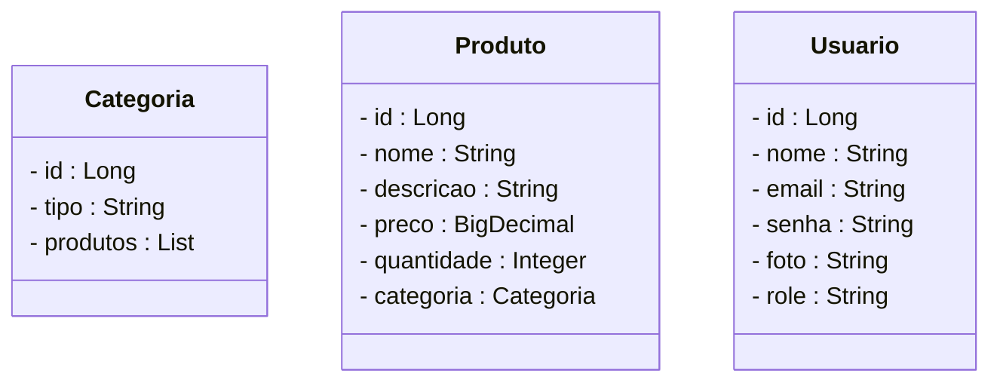
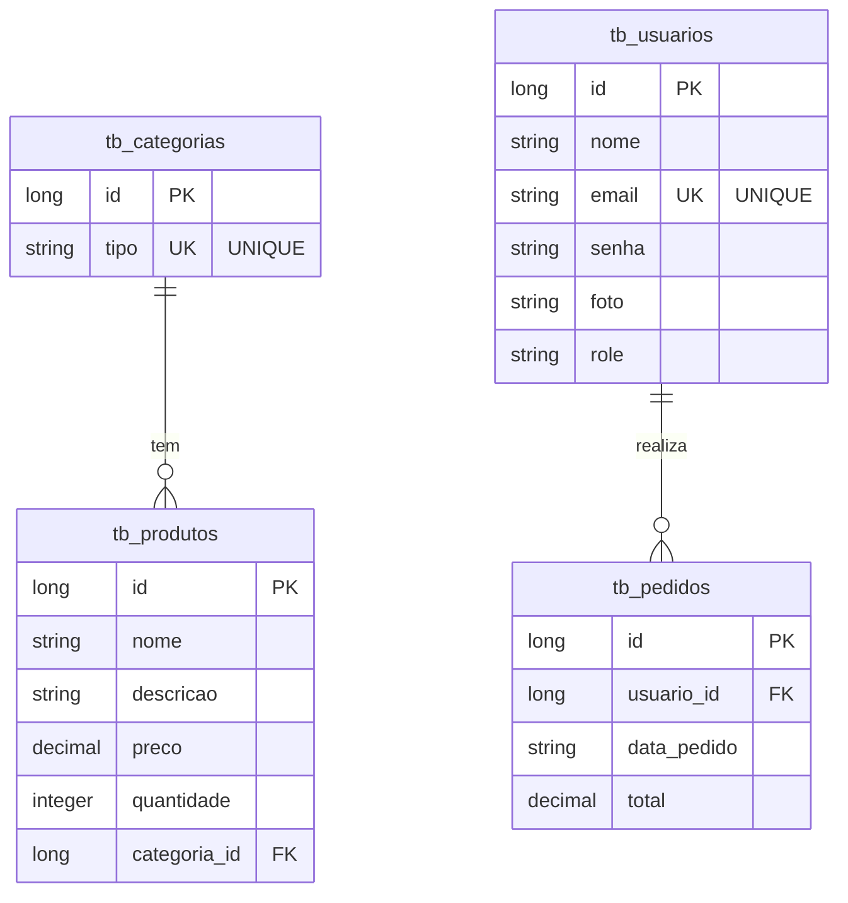

# Projeto Farmácia E-commerce - Backend com Spring Boot

<br />

<div align="center">
     
</div>

<br />

<div align="center">
  
  
  
  
  
  
 
</div>

<br />

## 1. Descrição

<br />

O **Projeto Farmácia E-commerce** é uma aplicação backend robusta e segura, desenvolvida para simular e gerenciar as operações de um sistema de comércio eletrônico no setor farmacêutico. Este sistema foi concebido para otimizar o gerenciamento de medicamentos, produtos diversos, estoque, vendas e atendimento ao cliente, ao mesmo tempo em que garante conformidade regulatória.

Desenvolvido com foco em boas práticas de API REST, este projeto implementa funcionalidades essenciais para um e-commerce de farmácia, desde o gerenciamento de produtos e categorias até um sistema de autenticação e autorização completo.

<br />

## 2. Sobre esta API

<br />

A API da Farmácia E-commerce foi desenvolvida utilizando **Java** e o **framework Spring Boot**, seguindo os princípios da Arquitetura RESTful. Ela oferece endpoints para o gerenciamento dos recursos **Produto** e **Categoria**, e conta com um sistema de segurança avançado para proteger as operações.

<br />

### 2.1. Principais funcionalidades da API:

<br />

1.  **Gerenciamento de Categorias:**
    * Criação, listagem, busca por ID, busca por tipo e remoção de categorias.
    * Validação de unicidade para o nome da categoria (impedindo duplicatas).
2.  **Gerenciamento de Produtos:**
    * Criação, listagem, busca por ID, busca por nome e remoção de produtos.
    * Relacionamento **Um para Muitos (One-to-Many)** com Categoria (um produto pertence a uma categoria).
    * Validação da existência da categoria ao cadastrar/atualizar um produto.
3.  **Sistema de Segurança Completo:**
    * **Autenticação de Usuários:** Via login tradicional (placeholder) e, principalmente, através de **Google OAuth2**.
    * **Geração de Token JWT:** Após o login (seja tradicional ou Google OAuth2), é gerado um JSON Web Token para autenticar requisições futuras na API.
    * **Persistência de Usuários OAuth2:** Usuários que se autenticam via Google são automaticamente cadastrados ou atualizados no banco de dados, com suas informações de perfil e uma `role` inicial.
    * **Autorização (RBAC):** Controle de acesso baseado em papéis (`ROLE_USER`, `ROLE_ADMIN`). Endpoints são protegidos com base nas permissões do usuário.
4.  **Documentação Interativa:**
    * Utilização do **SpringDoc OpenAPI (Swagger UI)** para documentar todos os endpoints da API.
    * A documentação é protegida e pode ser acessada após um login bem-sucedido (ex: login com Google redireciona para a página do Swagger UI).

<br />

## 3. Diagrama de Classes

<br />

O **Diagrama de Classes** modela a estrutura das entidades `Categoria` e `Produto` e seus relacionamentos no sistema.

<br />


&lt;br />

##4. Diagrama Entidade-Relacionamento (DER)


#O DER (Diagrama Entidade-Relacionamento) do projeto Farmácia E-commerce ilustra como as tabelas tb_categorias, tb_produtos e tb_usuarios se relacionam no banco de dados.





##5. Tecnologias utilizadas


| Item                     | Descrição                                 |
| :----------------------- | :---------------------------------------- |
| Servidor                 | Tomcat                                    |
| Linguagem de programação | Java (JDK 21)                             |
| Framework                | Spring Boot 3.x                           |
| ORM                      | JPA + Hibernate                           |
| Banco de dados Relacional| MySQL                                     |
| Segurança                | Spring Security                           |
| Autenticação             | JWT, Google OAuth2                        |
| Testes automatizados     | JUnit (configurado)                       |
| Documentação             | SpringDoc OpenAPI (Swagger UI)            |
| Ferramentas Dev          | Spring Tool Suite (STS), Insomnia / Postman |

## ✨ 6. Requisitos

Para executar o projeto localmente, você precisará ter instalado:

- ☕ **Java JDK 21+**  
- 🐬 **MySQL** (com usuário e senha: `root/root` ou os que você configurou)  
- 🧠 **Spring Tool Suite (STS)**  
- 📬 **Insomnia** ou **Postman** para testes de API  
- ☁️ **Google Cloud Console** para configurar as credenciais **OAuth2**

---

## 🚀 7. Como Executar o Projeto no STS

### ⚙️ 7.1. Configuração Inicial

1. **Clone o repositório:**
   ```bash
   git clone https://github.com/carlosmoronisud/projeto_final_bloco_02.git

Importe o projeto no STS:

Vá em File → Import...

Selecione General → Existing Projects into Workspace

Clique em Next, depois em Browse... e selecione a pasta farmacia do repositório clonado

Clique em Finish

Configure as credenciais Google OAuth2:

Acesse o Google Cloud Console

Crie um projeto e um OAuth 2.0 Client ID do tipo Web application

Adicione os redirecionamentos:

http://localhost:8080

http://localhost:8080/login/oauth2/code/google

Copie seu Client ID e Client Secret

Crie o arquivo de configuração local:

Caminho: src/main/resources/application-local.properties

Exemplo:

properties
Copy
Edit
spring.security.oauth2.client.registration.google.client-id=SEU_CLIENT_ID_DO_GOOGLE
spring.security.oauth2.client.registration.google.client-secret=SEU_CLIENT_SECRET_DO_GOOGLE
⚠️ Não comite este arquivo! Ele deve estar no .gitignore.

Configure o banco de dados:

Verifique as credenciais no arquivo application.properties

O banco deve se chamar db_farmacia

▶️ 7.2. Executando o Projeto
Atualize as dependências Maven:

Clique com o botão direito no projeto

Vá em Maven → Update Project

Marque Force Update of Snapshots/Releases e clique em OK

Limpe o projeto:

Vá em Project → Clean... e selecione o projeto

Inicie a aplicação:

Use o Boot Dashboard do STS

Clique em Start or Restart

Verifique se o banco de dados foi criado e se as tabelas foram geradas automaticamente

🧪 7.3. Testando a API e Segurança
Acesse: http://localhost:8080/

Deverá aparecer a mensagem: “Farmácia - Projeto em Construção”

Clique em "Login com Google" para autenticar e acessar a documentação da API

Após login, você será redirecionado para:
http://localhost:8080/swagger-ui.html

🔐 Testando Endpoints Protegidos
No Swagger UI ou Insomnia/Postman:

Faça login com Google

Copie o JWT da URL de redirecionamento

Envie nas requisições o cabeçalho:

makefile
Copy
Edit
Authorization: Bearer SEU_JWT_AQUI
Endpoint	Acesso	Esperado
GET /categorias	USER / ADMIN	200 OK com JWT válido
POST /categorias	ADMIN	201 Created com ROLE_ADMIN
DELETE /produtos/{id}	ADMIN	204 No Content com ROLE_ADMIN
PUT /produtos	ADMIN	200 OK com ROLE_ADMIN
Com ROLE_USER nos endpoints de ADMIN		403 Forbidden

💡 Dica:
Após o login com Google, o Spring Boot mantém sua sessão autenticada.
Se você acessar o Swagger diretamente (/swagger-ui.html), será redirecionado para autenticação se não estiver logado.

🤝 8. Contribuição
Este repositório faz parte de um projeto educacional da Generation Brasil.
Contribuições são muito bem-vindas! Você pode:

Criar uma issue para relatar bugs ou sugerir melhorias

Enviar um pull request

Compartilhar com colegas que estejam aprendendo Java + Spring Boot

📬 9. Contato
Desenvolvido por [Seu Nome/GitHub]
Dúvidas, sugestões ou colaborações?
Entre em contato via GitHub Issues
