# Pharmacy E-commerce Project - Spring Boot Backend

<br />

<div align="center">
     
</div>

<br />

<div align="center">
  
  
  
  
  
  
  
</div>

<br />

## 1. Project Overview

<br />

The **Pharmacy E-commerce Project** is a robust and secure backend application designed to simulate and manage the operations of an e-commerce system in the pharmaceutical sector. This system was conceived to optimize the management of medicines, various products, inventory, sales, and customer service, while ensuring regulatory compliance.

Developed with a focus on **REST API** best practices, this project implements essential functionalities for a pharmacy e-commerce, ranging from product and category management to a complete authentication and authorization system.

<br />

## 2. About This API

<br />

The Pharmacy E-commerce API was developed using **Java** and the **Spring Boot framework**, following **RESTful Architecture** principles. It offers endpoints for managing **Product** and **Category** resources, and features an advanced security system to protect operations.

<br />

### 2.1. Key API Features:

<br />

1.  **Category Management:**
    * Creation, listing, search by ID, search by type, and removal of categories.
    * Uniqueness validation for category names (preventing duplicates).
2.  **Product Management:**
    * Creation, listing, search by ID, search by name, and removal of products.
    * **One-to-Many** relationship with Category (a product belongs to one category).
    * Validation of category existence when registering/updating a product.
3.  **Comprehensive Security System:**
    * **User Authentication:** Via traditional login (placeholder) and, primarily, through **Google OAuth2**.
    * **JWT Token Generation:** After login (whether traditional or Google OAuth2), a JSON Web Token is generated to authenticate future API requests.
    * **OAuth2 User Persistence:** Users authenticating via Google are automatically registered or updated in the database, including their profile information and an initial `role`.
    * **Authorization (RBAC):** Access control based on roles (`ROLE_USER`, `ROLE_ADMIN`). Endpoints are protected based on user permissions.
4.  **Interactive Documentation:**
    * Uses **SpringDoc OpenAPI (Swagger UI)** to document all API endpoints.
    * The documentation is protected and can be accessed after a successful login (e.g., Google login redirects to the Swagger UI page).

<br />

## 3. Class Diagram

<br />

The **Class Diagram** models the structure of the `Category` and `Product` entities and their relationships within the system.

```mermaid
classDiagram
class Categoria {
  - id : Long
  - tipo : String
  - produtos : List<Produto>
}
class Produto {
  - id : Long
  - nome : String
  - descricao : String
  - preco : BigDecimal
  - quantidade : Integer
  - categoria : Categoria
}
class Usuario {
  - id : Long
  - nome : String
  - email : String
  - senha : String
  - foto : String
  - role : String
}
```

<br />


<br />
4. Entity-Relationship Diagram (ERD)
<br />


The ERD (Entity-Relationship Diagram) for the Pharmacy E-commerce project illustrates how the tb_categorias, tb_produtos, and tb_usuarios tables relate in the database.
```mermaid
erDiagram
  tb_categorias ||--o{ tb_produtos : has
  tb_usuarios ||--o{ tb_pedidos : performs
  
  tb_categorias {
    long id PK
    string tipo UK "UNIQUE"
  }
  tb_produtos {
    long id PK
    string nome
    string descricao
    decimal preco 
    integer quantidade
    long categoria_id FK
  }
  tb_usuarios {
    long id PK
    string nome
    string email UK "UNIQUE"
    string senha
    string foto
    string role
  }  
   tb_pedidos {
    long id PK
    long usuario_id FK
    string data_pedido
    decimal total
  }
```
5. Technologies Used
 
| Item | Description |
|---|---|
| Server | Tomcat |
| Programming Language | Java (JDK 21 )|
| Framework | Spring Boot 3.x |
| ORM | JPA + Hibernate |
| Relational Database | MySQL |
| Security | Spring Security |
| Authentication | JWT, Google OAuth2 |
| Automated Tests | JUnit (configured) |
| Documentation | SpringDoc OpenAPI (Swagger UI) |
| Dev Tools | Spring Tool Suite (STS), Insomnia / Postman |
✨ 6. Requirements
To run the project locally, you will need to have the following installed:
 * ☕ Java JDK 21+
 * 🐬 MySQL (with root/root or your configured username/password)
 * 🧠 Spring Tool Suite (STS)
 * 📬 Insomnia or Postman for API testing
 * ☁️ Google Cloud Console to configure OAuth2 credentials
🚀 7. How to Run the Project in STS
⚙️ 7.1. Initial Setup
 * Clone the repository:
   git clone [https://github.com/carlosmoronisud/projeto_final_bloco_02.git](https://github.com/carlosmoronisud/projeto_final_bloco_02.git)

 * Import the project into STS:
   * Go to File → Import...
   * Select General → Existing Projects into Workspace
   * Click Next, then Browse... and select the farmacia folder from the cloned repository.
   * Click Finish.
 * Configure Google OAuth2 credentials:
   * Access the Google Cloud Console.
   * Create a project and an OAuth 2.0 Client ID of type Web application.
   * Add the following redirect URIs:
     * http://localhost:8080
     * http://localhost:8080/login/oauth2/code/google
   * Copy your Client ID and Client Secret.
 * Create the local configuration file:
   * Path: src/main/resources/application-local.properties
   * Example:
     spring.security.oauth2.client.registration.google.client-id=YOUR_GOOGLE_CLIENT_ID
spring.security.oauth2.client.registration.google.client-secret=YOUR_GOOGLE_CLIENT_SECRET

   * ⚠️ Do not commit this file! It should be added to your .gitignore.
 * Configure the database:
   * Verify the credentials in the application.properties file.
   * The database should be named db_farmacia.
▶️ 7.2. Running the Project
 * Update Maven dependencies:
   * Right-click on the project.
   * Go to Maven → Update Project.
   * Check Force Update of Snapshots/Releases and click OK.
 * Clean the project:
   * Go to Project → Clean... and select the project.
 * Start the application:
   * Use the Boot Dashboard in STS.
   * Click Start or Restart.
   * Verify that the database was created and tables were automatically generated.
🧪 7.3. Testing the API and Security
 * Access: http://localhost:8080/
   * You should see the message: "Pharmacy - Project Under Construction."
 * Click "Login with Google" to authenticate and access the API documentation.
   * After logging in, you will be redirected to: http://localhost:8080/swagger-ui.html
🔐 Testing Protected Endpoints
In Swagger UI or Insomnia/Postman:
 * Log in with Google.
 * Copy the JWT from the redirect URL.
 * Send the following header in your requests:
   Authorization: Bearer YOUR_JWT_HERE

| Endpoint | Access | Expected |
|---|---|---|
| GET /categorias | USER / ADMIN | 200 OK with valid JWT |
| POST /categorias | ADMIN | 201 Created with ROLE_ADMIN |
| DELETE /produtos/{id} | ADMIN | 204 No Content with ROLE_ADMIN |
| PUT /produtos | ADMIN | 200 OK with ROLE_ADMIN |
| With ROLE_USER on ADMIN endpoints |  | 403 Forbidden |
💡 Tip:
After Google login, Spring Boot maintains your authenticated session.
If you access Swagger directly (/swagger-ui.html), you will be redirected for authentication if not already logged in.
🤝 8. Contribution
This repository is part of an educational project from Generation Brazil.
Contributions are highly welcome! You can:
 * Create an issue to report bugs or suggest improvements.
 * Submit a pull request.
 * Share with colleagues who are learning Java + Spring Boot.
 * 
📬 9. Contact
Developed by [https://github.com/carlosmoronisud/]
Questions, suggestions, or collaborations?
Reach out via GitHub Issues.
Questions, suggestions, or collaborations?
Reach out via GitHub Issues.

---
